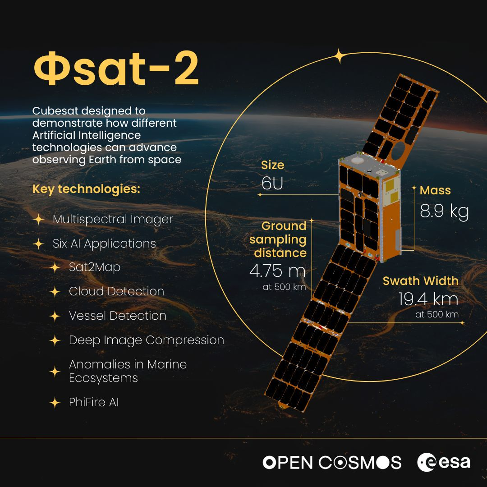

# Φsat‑2: AI-Powered Earth Observation in Orbit

<!-- Banner image -->

  

**Φsat‑2** is a next-generation CubeSat developed by the European Space Agency (ESA) and Open Cosmos to demonstrate the power of onboard Artificial Intelligence (AI) for Earth Observation (EO). Building on the success of Φsat‑1, this 6U satellite pushes the boundaries of in-orbit computing and edge-based EO analytics.

## 🛰️ *Bringing AI to the Stars • Revolutionizing Earth from Space*
**Ready to explore the cosmos with cutting-edge AI?**  
Connect with fellow space enthusiasts, developers, and researchers shaping tomorrow's Earth observation missions.

**Get involved • Share ideas • Build the future**

  
  
  

---

# 🚀 Mission Overview
<table>
<tr>
<td>

| **Mission Parameter** | **Details** |
|----------------------|-------------|
| **Launch Date** | 16 August 2024 |
| **Launch Vehicle** | Falcon 9 (Transporter-11) |
| **Orbit** | Sun-synchronous, ~510 km altitude |
| **Satellite Size** | 6U CubeSat (~22 × 10 × 33 cm) |
| **Mass** | ~9 kg |
| **Payload** | Multispectral imager (7 VNIR + 1 PAN band, 4.75 m GSD) |

</td>
<td>
<td align="right" style="padding-left: 0px;">

</td>
</tr>
</table>

---

## 🧠 Onboard AI Applications

Φsat‑2 executes a range of edge-AI apps directly onboard, reducing the need for raw data transmission:

- **Cloud detection** — filters uninformative imagery
- **Street-map generation** — real-time mapping for disaster zones
- **Vessel detection** — maritime monitoring & classification
- **Marine anomaly detection** — oil spills, algal blooms
- **Image compression** — efficient bandwidth use via DL models
- **Wildfire detection** — early alerting with PhiFire AI

These are deployed and updated in orbit using the **NanoSat MO Framework**, enabling a true "AI app store" for satellites.

---

## 🧩 Technical Stack

- **AI Processor**: Intel® Movidius™ Myriad 2 VPU (CogniSAT board by Ubotica)
- **Framework**: NanoSat MO Framework (Open Cosmos)
- **Ground Segment**: KSAT + Open Cosmos MCC
- **Downlink**: S-band TT&C + X-band for data

---

## 🤝 Mission Partners

- **Prime Integrator**: Open Cosmos  
- **Core Partners**:  
  - Ubotica (AI processing)  
  - CGI (software and services)  
  - Simera CH (imager)  
  - CEiiA, GEO-K, KP Labs (AI development & support)

---

## 🌍 Impact

Φsat‑2 pioneers real-time, onboard Earth analytics. Its applications serve high-impact domains like:

- **Disaster response**  
- **Environmental monitoring**  
- **Maritime safety**  
- **Climate change mitigation**

With a mission duration of at least 14 months, Φsat‑2 is redefining how we design, operate, and interact with EO satellites—smarter, faster, and more autonomous.

---

> ✨ *Φsat‑2 is not just a satellite; it's a leap toward in-orbit intelligence for a better Earth.*

---

## 📎 Resources

- [ESA Φsat‑2 Overview](https://www.esa.int/Applications/Observing_the_Earth/Phsat-2/Introducing_Phsat-2)
- [Open Cosmos Mission Page](https://www.open-cosmos.com/launches/phisat-2)
- [NanoSat MO Framework](https://github.com/opensatkit/nanosat-mo-framework)

---

## 📜 License

This repository and its documentation are released under the MIT License unless otherwise stated.

---

## 📄 Copyright

*© 2024 European Space Agency (ESA) & Open Cosmos — Where earthly dreams meet cosmic intelligence, one orbit at a time. All rights reserved, all boundaries transcended.*

